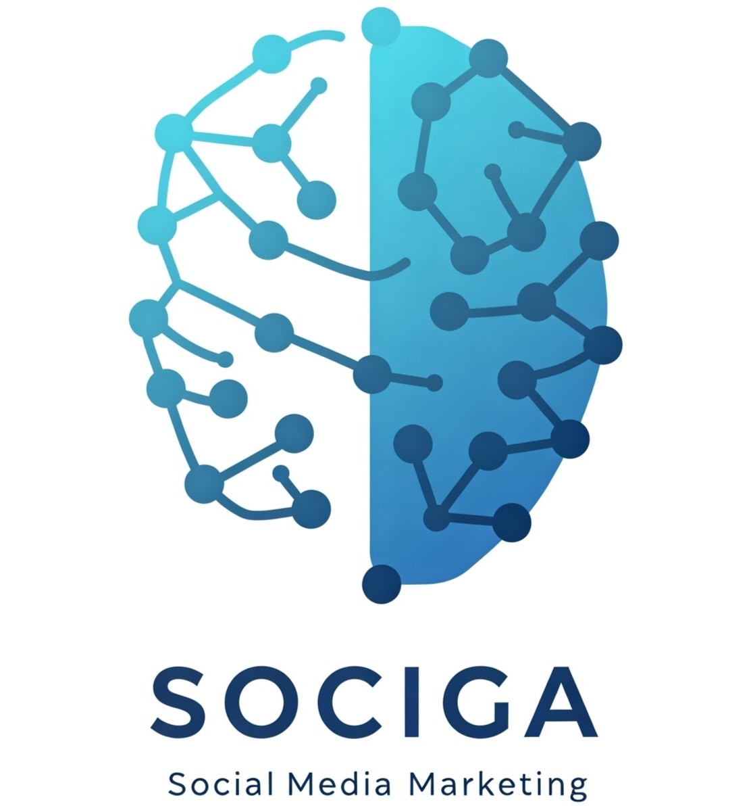
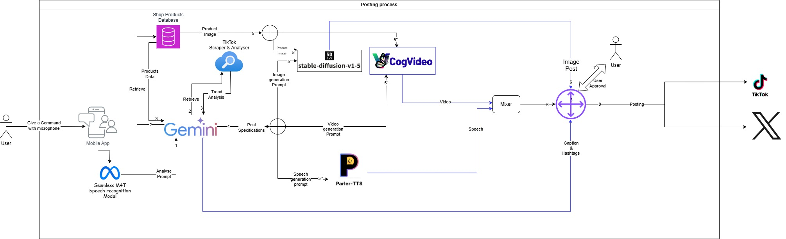
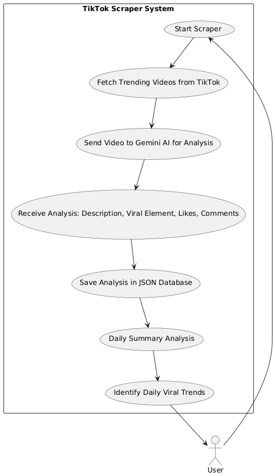
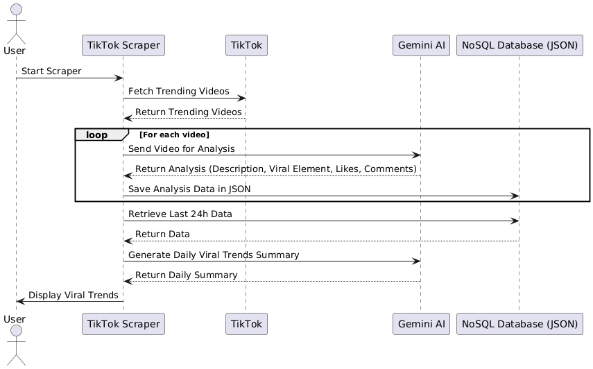

<a name="readme-top"></a>
<div align="center">

[![Contributors][contributors-shield]][contributors-url]
[![Forks][forks-shield]][forks-url]
[![Stargazers][stars-shield]][stars-url]
[![Issues][issues-shield]][issues-url]
[![MIT License][license-shield]][license-url]
[![LinkedIn][linkedin-shield]][linkedin-url]
[![LinkedIn][linkedin-shield]][linkedin-url-saif]
[![LinkedIn][linkedin-shield]][linkedin-url-brahim]
[![LinkedIn][linkedin-shield]][linkedin-url-ibrahim]
</div>

<!-- PROJECT LOGO --> 
<br />
<div align="center">
    <h1 style="font-size:35px">AI Content Generator for Business </h1>
    <br>
    <a href="https://github.com/Saifgharbii/AI-Odyssey-Hackathon">
      
    </a>
    <h1><a style="font-size:20px" href="https://github.com/Saifgharbii/AI-Odyssey-Hackathon" target="_blank">AI-Odyssey-Hackathon Project</a></h1>
    <br>
    <p style="font-size:20px" align="center">
        An AI-powered platform for generating engaging digital content
    <br>
    <br>
    <a href="https://github.com/Saifgharbii/AI-Odyssey-Hackathon/issues/new?labels=bug">Report Bug</a>
    ·
    <a href="https://github.com/Saifgharbii/AI-Odyssey-Hackathon/issues/new?labels=enhancement">Request Feature</a>
  </p>
</div>

<!-- TABLE OF CONTENTS -->
<details>
  <summary>Table of Contents</summary>
  <ol>
    <li><a href="#about-the-project">About The Project</a></li>
    <li><a href="#features">Features</a></li>
    <li><a href="#architecture">Architecture</a></li>
    <li><a href="#installation">Installation</a></li>
    <li><a href="#how-it-works">How It Works</a></li>
    <li><a href="#future-enhancements">Future Enhancements</a></li>
    <li><a href="#contributing">Contributing</a></li>
    <li><a href="#license">License</a></li>
  </ol>
</details>

<!-- ABOUT THE PROJECT -->
## About The Project

The AI Content Generator is a comprehensive solution designed to help businesses create engaging digital content efficiently. By leveraging multiple AI models, it extracts trending TikTok content and processes it to generate text, images, and videos. This project is our submission for the **AI-Odyssey-Hackathon**.

<div style="display:flex;flex-direction:column;justify-content:canter;" align="center">
    <div>
        
        <h2>Whole System Workflow</h2>
    </div>
    <br/>
    <div>
        
        <h2>Scraping System Workflow</h2>
    </div>
    <br/>
    <div>
        
        <h2>Scraped Videos to User sequence Diagram</h2>
    </div>
</div>

<p align="right">(<a href="#readme-top">back to top</a>)</p>

## System in Action
<div style="display:flex;flex-direction:column;justify-content:canter;" align="center">

  [](https://www.youtube.com/watch?v=icdwRWpN3w8)
  <h1>Scraping Tiktok Demo</h1>
</div>
<br>
<br>
<div style="display:flex;flex-direction:column;justify-content:canter;" align="center">

  [](https://www.youtube.com/shorts/e4Rox-UEQdU)
  <h1>Mobile App in action</h1>
</div>
<p align="right">(<a href="#readme-top">back to top</a>)</p>

## Features

- **Content Scraping**: Uses Giminia to extract trending content from TikTok
- **Speech-to-Text**: Converts spoken words into text using Seamless-M4T
- **Text-to-Image**: Generates images from text prompts using Stable Diffusion
- **Image-to-Video**: Creates videos from images using CogVideoX
- **Text-to-Speech**: Converts text into speech using Parler-TTS

<p align="right">(<a href="#readme-top">back to top</a>)</p>

## Architecture

The project operates on three main servers that communicate over a shared Docker network:

1. **Main Server (main_server)**: Handles primary application logic and API requests
2. **Models Workflow (models_workflow)**: Manages AI model interactions
3. **Speech Generation (speech_gen)**: Generates speech from text

<p align="right">(<a href="#readme-top">back to top</a>)</p>

## Installation

### Prerequisites

- Docker installed on your system
- Python 3.x (for local development and debugging)

### Setup Instructions

1. Clone the repository:
```bash
git clone https://github.com/Saifgharbii/AI-Odyssey-Hackathon.git
cd ai-content-generator
```

2. Start the application:
```bash
docker-compose up --build
```

3. Access the services:
- Main Server: http://localhost:8000
- Models Workflow: http://localhost:8001
- Speech Generation: http://localhost:8002

<p align="right">(<a href="#readme-top">back to top</a>)</p>

## How It Works

### API Endpoints

#### /generate_content (POST)
Processes user input and generates content through the following steps:

1. **Input Processing**
   - Accepts text or audio input
   - Converts audio to text if necessary

2. **Content Generation**
   - Analyzes user intent
   - Generates images from prompts
   - Creates videos from images
   - Produces audio from scripts

3. **Final Output**
   - Combines audio and video
   - Returns processed video file

<p align="right">(<a href="#readme-top">back to top</a>)</p>

## Future Enhancements

- Improve speech-to-text accuracy with better models
- Add more customization options for video editing
- Enhance scalability through Kubernetes deployment

<p align="right">(<a href="#readme-top">back to top</a>)</p>

## Contributing

Contributions are what make the open source community such an amazing place to learn, inspire, and create. Any contributions you make are **greatly appreciated**.

1. Fork the Project
2. Create your Feature Branch (`git checkout -b feature/AmazingFeature`)
3. Commit your Changes (`git commit -m 'Add some AmazingFeature'`)
4. Push to the Branch (`git push origin feature/AmazingFeature`)
5. Open a Pull Request

<p align="right">(<a href="#readme-top">back to top</a>)</p>

## License

Distributed under the MIT License. See `LICENSE` for more information.

<p align="right">(<a href="#readme-top">back to top</a>)</p>

<!-- MARKDOWN LINKS & IMAGES -->
[contributors-shield]: https://img.shields.io/github/contributors/Saifgharbii/AI-Odyssey-Hackathon.svg?style=for-the-badge
[contributors-url]: https://github.com/Saifgharbii/AI-Odyssey-Hackathon/graphs/contributors
[forks-shield]: https://img.shields.io/github/forks/Saifgharbii/AI-Odyssey-Hackathon.svg?style=for-the-badge
[forks-url]: https://github.com/Saifgharbii/AI-Odyssey-Hackathon/network/members
[stars-shield]: https://img.shields.io/github/stars/Saifgharbii/AI-Odyssey-Hackathon.svg?style=for-the-badge
[stars-url]: https://github.com/Saifgharbii/AI-Odyssey-Hackathon/stargazers
[issues-shield]: https://img.shields.io/github/issues/Saifgharbii/AI-Odyssey-Hackathon.svg?style=for-the-badge
[issues-url]: https://github.com/Saifgharbii/AI-Odyssey-Hackathon/issues
[license-shield]: https://img.shields.io/github/license/Saifgharbii/AI-Odyssey-Hackathon.svg?style=for-the-badge
[license-url]: https://github.com/Saifgharbii/AI-Odyssey-Hackathon/blob/master/LICENSE.txt
[linkedin-shield]: https://img.shields.io/badge/-LinkedIn-black.svg?style=for-the-badge&logo=linkedin&colorB=555
[linkedin-url]: https://linkedin.com/in/chater-marzougui-342125299/
[linkedin-url-saif]: https://www.linkedin.com/in/saif-gharbi-8956612a2/
[linkedin-url-brahim]: https://www.linkedin.com/in/brahim-ghouma/
[linkedin-url-ibrahim]: https://www.linkedin.com/in/ibrahim-darghouthi/